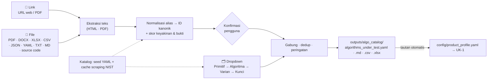

# 🔐 Cryptan.ID Test Suite

**Cryptan.ID Test Suite** adalah perangkat pengujian produk kriptografi untuk praktikum
**Pelatihan Sertifikasi Cryptographic Analyst (CA) Angkatan 1 — Politeknik Siber dan Sandi Negara**.
Repositori ini dibangun bertahap per Unit Kompetensi (UK-1 s.d. UK-8); setiap UK menghasilkan
**JSON terstruktur** yang menjadi masukan UK berikutnya.

| Modul | Unit | Status |
|---|---|---|
| **algo_catalog** | Daftar Algoritma yang Diuji — melengkapi UK-1 KUK 1.1 | ✅ selesai (`algo_catalog/`) |
| **UK-1** | J.61KRP00.012.1 — Menentukan Metode Pengujian yang akan Dilakukan | ✅ selesai (`uk1_metode/`) |
| UK-2 | Menyusun Skenario Pengujian | ⏳ menyusul |
| UK-3 … UK-8 | — | ⏳ menyusul |

Objek praktikum mencakup **kelima kelas primitif** (satu profil per kelas):

| Kelas primitif | Algoritma | Implementasi referensi | Known Answer Test |
|---|---|---|---|
| Block cipher | AES-128 (mode CTR) | `core/aes.py` | FIPS 197 App. B & C.1, SP 800-38A F.1.1 |
| Stream cipher | ChaCha20 | `core/chacha20.py` | RFC 8439 §2.3.2, §2.4.2, A.1 |
| Fungsi hash | SHA3-256 | `core/keccak.py` | FIPS 202 / NIST CSRC examples + uji silang `hashlib` |
| PKC | RSA-OAEP-2048 | `core/rsa_oaep.py` | PKCS #1 v2.1 `oaep-vect.txt` (Example 1 & 10, 12 vektor) |
| DSS | ECDSA P-256 + SHA-256 | `core/ecdsa_p256.py` | RFC 6979 A.2.5 |

Profil produk (hipotetis): **Cryptan.ID SecureLib** — library perangkat lunak Linux x86-64, ditulis dalam C
dengan binding Python, diuji secara **grey box**. Seluruh data produk bersifat **ilustratif**.

---

## 🚀 Instalasi & menjalankan

```bash
make install        # python3 -m venv .venv && pip install -r requirements.txt
make kat            # KAT implementasi referensi → LULUS/GAGAL
make run            # UK-1 end-to-end untuk kelima algoritma
make test           # 159 unit test (pytest)
make serve          # dashboard statis di http://localhost:8000
```

Perintah utama UK-1 (tanpa `make`):

```bash
python -m uk1_metode --profile config/product_profile.yaml            # semua algoritma ("All")
python -m uk1_metode --profile config/profiles/aes128.yaml            # satu algoritma
python -m uk1_metode --profile config/product_profile.yaml --quick    # sampel kecil (demo/CI)
```

Kebutuhan: Python ≥ 3.10, `PyYAML`; opsional `python-docx` (keluaran DOCX) dan `cryptography`
(uji silang interoperabilitas dengan OpenSSL).

## 📁 Struktur repositori

```
cryptan-id-test-suite/
├── README.md                     # dokumen ini (peta KUK → file)
├── config/
│   ├── product_profile.yaml      # profil produk bersama (input semua UK) + daftar profil algoritma
│   └── profiles/                 # aes128 · chacha20 · sha3_256 · rsa_oaep_2048 · ecdsa_p256 (extends)
├── algo_catalog/                 # Daftar Algoritma yang Diuji (UK-1 KUK 1.1) — lihat bagian khusus di bawah
├── core/                         # implementasi referensi + util bersama (dipakai UK-1..UK-8)
│   ├── aes.py chacha20.py keccak.py rsa_oaep.py ecdsa_p256.py numtheory.py
│   ├── boolean.py                # Walsh/ANF, NL, DDT, LAT, derajat, SAC, branch number/MDS, Berlekamp–Massey
│   ├── stats.py                  # uji SP 800-22 (monobit, runs), igamc, χ², Welch t (TVLA)
│   ├── kat.py                    # runner Known Answer Test
│   └── vectors/                  # test vector resmi (JSON)
├── uk1_metode/                   # UK-1
│   ├── profile.py                # KUK 1.1
│   ├── attack_kb.py              # KUK 1.2  + data/attacks.yaml
│   ├── standards_kb.py           # KUK 1.3  + data/standards.yaml
│   ├── decompose.py              # KUK 2.1  (dekomposisi komponen)
│   ├── component_analysis.py     # KUK 2.1  (HASIL UJI LANGSUNG)
│   ├── mapping.py                # KUK 2.2  + data/methods.yaml
│   ├── resources.py              # KUK 2.3
│   ├── selector.py               # KUK 3.1
│   ├── parameters.py             # KUK 3.2
│   ├── traceability.py           # Matriks keterlacakan
│   ├── report.py                 # JSON + Markdown + DOCX + CSV
│   └── pipeline.py / __main__.py # orkestrasi & CLI
├── outputs/uk1/<algoritma>/      # contoh keluaran hasil eksekusi (lihat di bawah)
├── web/ + scripts/build_site.py  # dashboard statis (Vercel / Netlify)
└── tests/                        # pytest: core KAT, sifat komponen, EK 1, EK 2, EK 3, E2E
```

## 🧭 Peta KUK → modul → bagian dokumen → test

| EK | KUK | Yang dikerjakan kode | File | Bab dokumen | Test |
|---|---|---|---|---|---|
| 1 | 1.1 Informasi desain & teknik implementasi | Baca, gabung (`extends`) & validasi profil; Profil Produk | `profile.py`, `config/` | 1 | `test_uk1_ek1.py::test_kuk_1_1_*` |
| 1 | 1.2 Tren serangan terhadap platform | Basis serangan desain/protokol/bahasa/platform (model, kompleksitas log2, rujukan, status), filter otomatis | `attack_kb.py`, `data/attacks.yaml` | 2.2 | `test_kuk_1_2_*` |
| 1 | 1.3 Best practice metode pengujian | Primitif → standar ISO/IEC & NIST; Daftar Referensi | `standards_kb.py`, `data/standards.yaml` | 2.1 | `test_kuk_1_3_*` |
| 2 | 2.1 Komponen berpotensi lemah | Dekomposisi + hitung langsung NL, DDT, LAT, derajat, SAC, titik tetap, branch number/MDS, avalanche per ronde, BM, padding, kapasitas sponge, primalitas, Wiener/Boneh–Durfee, oracle OAEP, validasi kurva/kunci, bias nonce, malleability | `decompose.py`, `component_analysis.py`, `core/boolean.py` | 3 | `test_core_components.py`, `test_kuk_2_1_*` |
| 2 | 2.2 Best practice vs potensi kelemahan | Matriks Komponen → Kelemahan → Metode → Standar; 3 lapis × 3 level; penyesuaian akses | `mapping.py`, `data/methods.yaml` | 4 | `test_kuk_2_2_*` |
| 2 | 2.3 Kesesuaian sumber daya internal | Benchmark ops/detik, estimasi 2^k ÷ ops/detik, LAYAK / VERSI TEREDUKSI / TIDAK LAYAK, SDM/tools | `resources.py` | 5 | `test_kuk_2_3_*` |
| 3 | 3.1 Penetapan metode | Skor relevansi × kelayakan × akses; alasan pilih/tolak | `selector.py` | 6.1 | `test_uk1_ek3.py::test_kuk_3_1_*` |
| 3 | 3.2 Penetapan parameter | KAT, MCT, avalanche, SP 800-22 (100 × 10⁶ bit, α = 0,01, ambang proporsi), TVLA \|t\| > 4,5, ronde tereduksi, dll. | `parameters.py` | 6.2 | `test_kuk_3_2_*` |
| — | Keterlacakan | K-xx / I-xx → objek → metode → rujukan → kriteria lulus | `traceability.py` | 7 | `test_traceability_*` |

## 📤 Keluaran (`outputs/uk1/<algoritma>/`)

| File | Isi |
|---|---|
| `uk1_penetapan_metode.json` | Struktur lengkap (profil, referensi, serangan, komponen, matriks, sumber daya, metode, parameter, keterlacakan) + blok `handoff_uk2` — **masukan UK-2** |
| `UK1_Dokumen_Penetapan_Metode.md` / `.docx` | Dokumen bukti unjuk kerja, Bab 1–8 |
| `matriks_pemetaan.csv` | Matriks komponen–kelemahan–metode |
| `matriks_keterlacakan.csv` | Matriks keterlacakan |
| `outputs/uk1/index.json` | Indeks semua algoritma (dipakai dashboard) |

Contoh keluaran singkat (`make run`):

```
■ AES-128 (Block cipher)
  KAT core/          : [LULUS] 6/6
  Berpotensi lemah   : C-IMPL-TBL
  Perlu perhatian    : C-MODE, C-API, C-MEM, C-PLAT
  Metode terpilih    : 16 → M-FUZZ, M-NONCE, M-SP80022, M-TIMING, M-ZEROIZE, M-AVAL, M-DIFFUSION, M-RNG,
                            M-SBOX, M-KEYSIZE, M-DIFF*, M-INT*, M-LIN*, M-KAT, M-MCT, M-SELFTEST
  Metode ditolak     : 5 → M-BRUTE, M-CACHE, M-TVLA, M-FAULT, M-CODEREVIEW
■ RSA-OAEP-2048 (PKC)
  KAT core/          : [LULUS] 12/12
  Metode terpilih    : 12 → M-FUZZ, M-ORACLE, M-PKV, M-TIMING, … , M-FACT*, M-KAT, M-SELFTEST
(* = varian ronde/ukuran tereduksi)
```

Nilai acuan yang dijadikan unit test (HASIL UJI LANGSUNG): AES S-box **NL = 112, DU = 4, derajat = 7**,
MixColumns **branch number = 5 (MDS)**; χ Keccak **DU = 8, derajat = 2**.


## 🗂️ Modul `algo_catalog/` — Daftar Algoritma yang Diuji (UK-1 KUK 1.1)

Menyusun daftar lengkap algoritma yang akan diuji, berikut **semua varian** (mode, kurva, parameter set,
panjang digest) dan **semua varian panjang kuncinya**. Ada tiga cara input yang bisa digabung:



| Komponen | File |
|---|---|
| Model data (`id`, `primitive`, `family`, `variant`, `key_bits`, `security_strength_bits`, `status_nist`, `standards`, `aliases`, `source`) | `algo_catalog/schema.py` |
| Katalog awal (offline) — 128 entri / 225 kombinasi | `algo_catalog/data/catalog_seed.yaml` |
| Cache hasil scraping (tanggal + URL sumber) | `algo_catalog/data/catalog_cache.json` |
| Sumber scraping (ACVP, CAVP, SP 800-131A, SP 800-57, IR 8547, ISO opsional) | `config/sources.yaml`, `algo_catalog/scraper.py` |
| Normalisasi alias & deteksi teks (stdlib, juga jalan di browser via Pyodide) | `algo_catalog/normalize.py` |
| Opsi Link (robots.txt, User-Agent, jeda) · File (parser per tipe) · Dropdown | `link.py` · `extract.py` · `picker.py` |
| Gabung/dedup/konfirmasi/peringatan · keluaran | `selection.py` · `output.py` |
| GUI Streamlit · CLI | `app.py` · `__main__.py` |
| Contoh input & keluaran | `samples/input/`, `samples/output/opsi_{file,dropdown,link}/` |

**Menjalankan**

```bash
make catalog-scrape                         # python -m algo_catalog scrape --refresh (offline → seed)
python -m algo_catalog list --tree          # tampilkan katalog (--primitive hash, dst.)
python -m algo_catalog select --url https://pages.nist.gov/ACVP/
python -m algo_catalog select --file samples/input/CryptoService.java --interactive
python -m algo_catalog select --pick "AES:GCM:128,256" "ECDSA:P-384" "ML-KEM:768" "AES:*"
make catalog                                # daftar produk dari samples (file + dropdown) → tautkan ke UK-1
make catalog-gui                            # streamlit run algo_catalog/app.py
```

Hasil deteksi otomatis (link/file) **wajib dikonfirmasi**:
- **`--interactive`:** konfirmasi satu per satu.
- **`--yes`:** terima otomatis deteksi dengan keyakinan ≥ `--min-confidence` (default 0,6).
- **Tanpa keduanya:** deteksi masuk bagian "kandidat belum dikonfirmasi".

Normalisasi menangani alias dengan maupun tanpa panjang kunci:
- `aes256gcm`, `AES/GCM/NoPadding` + kunci 256 (parameter `--key-bits` atau konteks `kg.init(256)`), dan `EVP_aes_256_gcm` → `AES-256-GCM`.
- `RSA/ECB/OAEPWithSHA-256…` + `initialize(3072)` → `RSA-OAEP-3072`.
- `ec.SECP384R1()` + "ECDSA" di dekatnya → `ECDSA-P384` dengan keyakinan lebih tinggi daripada `ECDH-P384`.

Contoh keluaran `make catalog`:

```
Daftar akhir: 33 kombinasi · Block cipher 6, Stream cipher 2, Fungsi hash / XOF 7, MAC / AEAD ringan 4,
              PKC / KEM / key agreement 7, Tanda tangan digital 6, DRBG 1
Peringatan: 6 tinggi · 10 sedang (rentan kuantum)
  ⚠ PRESENT-80: security strength 80 bit < 112 bit (SP 800-57 Pt.1)
  ⚠ TDEA-3KEY: status NIST disallowed (SP 800-131A Rev.2)
  ⚠ SHA-1: status NIST disallowed (SP 800-131A Rev.2)
  ⚠ RSAES-PKCS1-V1_5-1024: status NIST disallowed (SP 800-131A Rev.2)
  → outputs/algo_catalog/algorithms_under_test.yaml  (+ .json, Daftar_Algoritma_Uji.md/.csv/.xlsx)
  → config/product_profile.yaml  (ditautkan: algorithms_under_test)
```

Dashboard web (`katalog.html`) menyediakan opsi Dropdown dan deteksi File/teks di browser. Deteksi memakai
`normalize.py` yang sama melalui Pyodide.

**Asumsi algo_catalog**
- Status NIST dan security strength di seed dikurasi manual dari SP 800-131A Rev.2, SP 800-57 Pt.1 Tabel 2,
  SP 800-56A Rev.3/56B Rev.2 App. D (FFC/IFC > 3072), dan FIPS 202–205. Scraping hanya menambah entri baru
  (bertanda `PERLU_VERIFIKASI`) dan mencatat bukti `seen_in`; status di seed tidak diubah otomatis.
- `key_bits` untuk HMAC = panjang kunci HMAC yang umum. Untuk cSHAKE/KMAC = varian keamanan. Untuk LMS/XMSS = panjang hash *n*.
  Untuk DRBG = security strength instansiasi. Untuk XTS = 2 × kunci AES.
- Deteksi berbasis alias/regex. Penyebutan famili tanpa varian (mis. "AES-256" saja) tidak dipetakan;
  pilih variannya lewat Dropdown.
- Opsi Link di browser terbatas CORS; gunakan CLI/GUI untuk halaman non-CORS dan PDF.

**Entri bertanda `PERLU_VERIFIKASI`:**
- **Status NIST:** AES-FF3-1 (draf SP 800-38G Rev.1 mengusulkan penghapusan), AES-GCM-SIV, X25519/X448 (key agreement).
- **Security strength:** Poly1305, RC4, LMS/HSS, XMSS, HKDF, SP 800-108 KDF, PBKDF2.
- **Hasil scraping:** seluruh entri tambahan dari ACVP.

## 🏷️ Konvensi sumber data

- **HASIL UJI LANGSUNG** — dihitung oleh kode pada saat eksekusi.
- **HASIL LITERATUR** — dikutip dari rujukan (`data/attacks.yaml`, `data/standards.yaml`).
- **KLAIM PROFIL** — berasal dari profil produk (grey box; wajib diverifikasi oleh metode terpilih).
- **`PERLU_VERIFIKASI`** — angka/klaim literatur yang wajib dicek ke sumber primer sebelum dikutip resmi.

## 📝 Catatan

**Asumsi**
- Produk, vendor, dan klaim implementasi (mis. AES berbasis tabel, nonce 64-bit) bersifat **ilustratif**.
- Benchmark memakai implementasi referensi pure Python → estimasi waktu adalah **batas atas konservatif**
  (`resources.speedup_factor` dapat dinaikkan untuk implementasi teroptimasi).
- Kunci RSA sampel dibangkitkan dengan RNG uji deterministik (seed) agar hasil dapat direproduksi —
  hanya untuk telaah, bukan kunci produksi.
- Implementasi `core/` tidak constant-time dan **tidak untuk produksi**; pengukuran timing pada `core/`
  bersifat indikatif, produk diuji melalui M-TIMING / M-ORACLE.

**Bertanda `PERLU_VERIFIKASI`** (lihat Bab 2 dokumen): kompleksitas integral 6 ronde AES (A-BC-05),
impossible differential/MITM 7 ronde (A-BC-06), DFA (A-BC-11), ChaCha PNB / differential-linear (A-SC-02/03),
preimage Keccak ronde tereduksi & zero-sum (A-H-04/05), jumlah query Manger & ROBOT (A-P-06/07),
HNP/Minerva (A-D-03), contoh timing Keyczar (A-L-01), serta tahun terbit SP 800-90C, SP 800-232, ISO/IEC 17825.

**Saran pengembangan untuk UK-2 (Menyusun Skenario Pengujian)**
- Baca `handoff_uk2` di `uk1_penetapan_metode.json`: setiap metode terpilih sudah membawa target komponen,
  varian (penuh/tereduksi), parameter terukur, dan ID kebutuhan (K-xx/I-xx).
- Turunkan tiap metode menjadi skenario (prakondisi, langkah, data uji, hasil yang diharapkan) sesuai
  ISO/IEC/IEEE 29119-3, lalu jadwalkan terhadap kapasitas jam-orang dari KUK 2.3.
- Implementasi eksekutor SP 800-22 lengkap (15 uji) dan harness dudect di `core/` agar dapat dipakai UK-3+.

## 🌐 Deploy

Dashboard statis (`web/`) membaca `outputs/uk1/*.json`. `vercel.json` dan `netlify.toml` menjalankan
`python3 scripts/build_site.py` dan mempublikasikan folder `site/`.

---
Dibuat oleh **Dea Saka Kurnia Putra** — Pelatihan Sertifikasi *Cryptographic Analyst* Angkatan 1.
Lisensi MIT.
